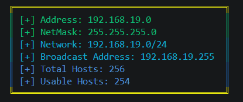

# SNETINFO - A tool for quick info about subnets
~~~~ python
━━━━━━━━━━━━━━━━━━━━━━━━━━━━━━━━━━━━━━━━━━━━━━━━━━━━━━━━━━━━━━━━━
███████╗███╗   ██╗███████╗████████╗██╗███╗   ██╗███████╗ ██████╗ 
██╔════╝████╗  ██║██╔════╝╚══██╔══╝██║████╗  ██║██╔════╝██╔═══██╗
███████╗██╔██╗ ██║█████╗     ██║   ██║██╔██╗ ██║█████╗  ██║   ██║
╚════██║██║╚██╗██║██╔══╝     ██║   ██║██║╚██╗██║██╔══╝  ██║   ██║
███████║██║ ╚████║███████╗   ██║   ██║██║ ╚████║██║     ╚██████╔╝
╚══════╝╚═╝  ╚═══╝╚══════╝   ╚═╝   ╚═╝╚═╝  ╚═══╝╚═╝      ╚═════╝ 
━━━━━━━━━━━━━━━━━━━━━━━━━━━━━━━━━━━━━━━━━━━━━━━━━━━━━━━━━━━━━━━━━
            Get Subnetting Information quickly!!

Usage:
      subnetting_calc.py <ip_address>/<CIDR>
Example:
      python subnetting_calc.py 192.168.13.12/24
~~~~
## Output :

# Libraries used for this project :

- **argparser** ---> https://docs.python.org/es/3/library/argparse.html
- **ipadress** ---> https://docs.python.org/3/library/ipaddress.html
- **termcolor** ---> https://pypi.org/project/termcolor/

## Conclusion
There are lot of web apps that can make the same process, but i wanted to have a local tool to access subnetting information quickly.